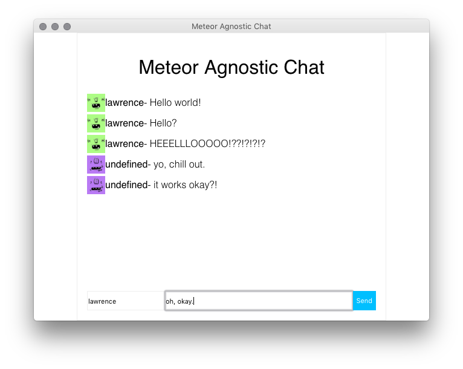

# meteor-agnostic-chat

Make Meteor Frontend Agnostic.



This project demonstrates that we can use Meteor as a backend, and use any frontend we like to connect to the Meteor backend.

The backend is in `/backend` and there are two frontend clients for demonstration pueposes, that you can use in `/frontend`.

To get running, you need to setup the backend.

```
cd backend
meteor npm install
meteor -p 9000 # we are expecting meteor on port 9000
```

And setup a frontend client.

```
cd frontend/vanilla
npm install
npm run dev
```

Then browse to [http://localhost:8080](http://localhost:8080).

You can even run another client alongside...

```
cd frontend/vue
npm install
webpack-dev-server --inline --hot --port=8081 # or npm run dev if you want to run it normally
```

And check it out on [http://localhost:8081](http://localhost:8081).
